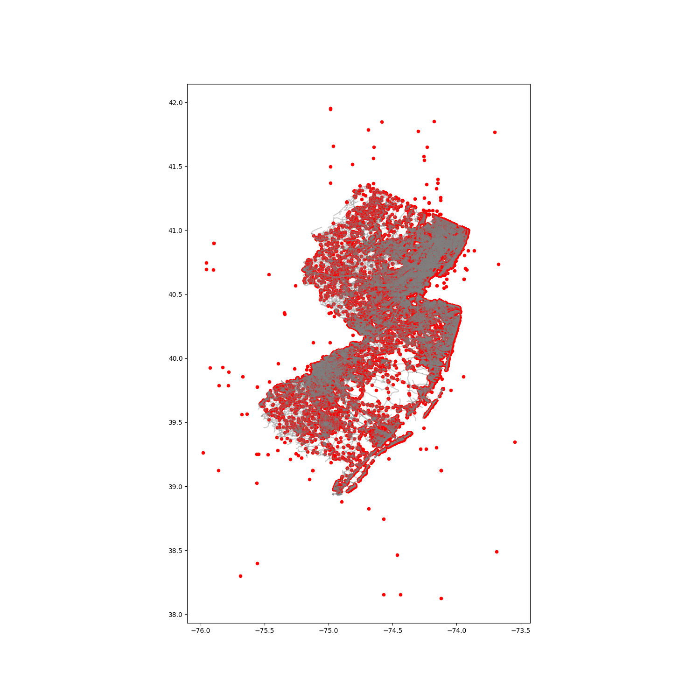

# Milepost2LonLat

This repository maps NJDOT crash data from Milepost in Straight Line Diagram to the WGS coordinates (lon/lat)

## Description

Many transportation crash data only provides the milepost infomation instead of the lon/lat coordinates, which makes researchers hard to locate the accident without a Linear Refrencing System (LFS). This repository targets at solving this issue by using the [Straight Line Diagram (SLD) shapefile ](https://www.state.nj.us/transportation/refdata/gis/data.shtm) and geopandas to map the milepost in SLD to the WGS coordinates. The following figure shows the results generated from the 2019 crash data. Note those points outside the New Jersey are errors from the raw data, which provides no milepost information and wrong coordinates.


## Getting Started

### Dependencies

* pandas
* matplotlib
* [geopandas](https://geopandas.org/getting_started/install.html) 

### Executing program

* download shapefile and crash data (already provided in this repo)
* run the command
```
python main.py
```


## Authors

Contributors names and contact info

Yizhou(Joe) Wang 
[@LinkedIn](https://www.linkedin.com/in/yizhouwangxj/)
[@Email](mailto:wyzks123@gmail.com)
